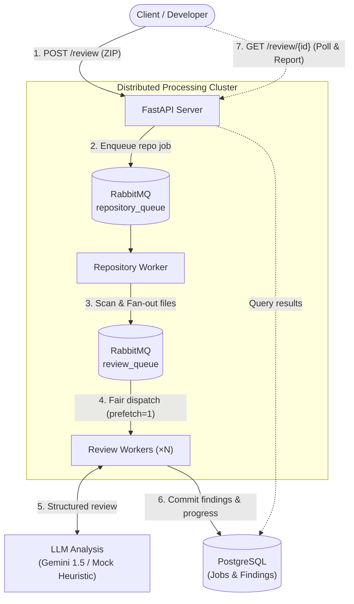
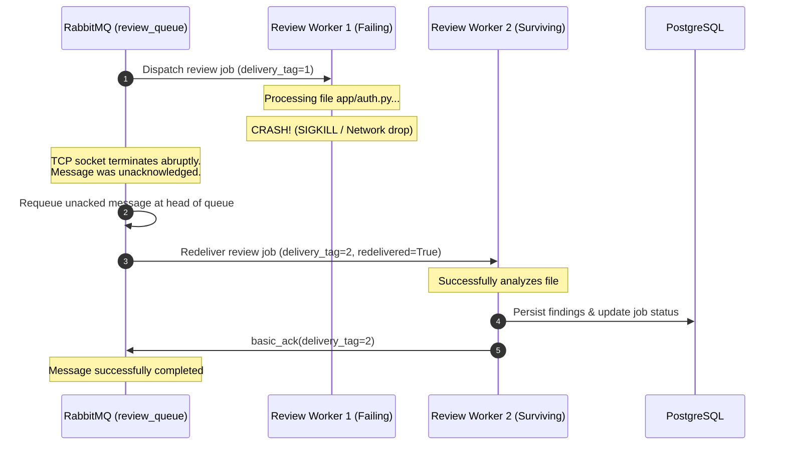

# Distributed AI Code Review System

> An asynchronous, fault-tolerant distributed system that analyzes multi-file code repositories using parallel workers, RabbitMQ, PostgreSQL, and LLM-based static analysis to detect security vulnerabilities, bugs, and performance anti-patterns.

[](https://www.python.org/)
[](https://fastapi.tiangolo.com/)
[](https://www.rabbitmq.com/)
[](https://www.postgresql.org/)
[](https://www.docker.com/)

---

## 1. Key Highlights

* **Asynchronous Fan-Out Architecture**: Decouples API ingestion from repository extraction and code review via two dedicated RabbitMQ queues (`repository_queue` and `review_queue`).
* **Horizontal Worker Scalability**: Review workers consume independently using fair dispatch (`prefetch_count=1`), scaling from 1 to 8+ workers on demand (`--scale review-worker=N`).
* **True Fault Tolerance**: At-least-once message processing with manual acknowledgments (`basic_ack`), automatic redelivery upon worker crash (`SIGKILL`), and dead-letter queue routing (`review_dlq`).
* **Secure Archive Decompression**: Zip Slip path traversal protection, recursive directory scanner, binary file filtering, and configurable file size limits.
* **Pluggable LLM Analysis**: Supports live LLM providers (Google Gemini 1.5) with strict JSON output mode and an offline high-fidelity mock analyzer with simulated latency for reliable benchmarking.
* **Persistent Relational State**: PostgreSQL tracking repositories, review jobs, and individual findings with atomic database increments preventing concurrent worker race conditions.
* **Empirical Benchmarks**: Measured processing speedup and throughput across 1, 2, 4, and 8 workers on a fixed 60-file repository.

---

## 2. Architecture



---

## 3. How It Works: Review Request Lifecycle

1. **Submission (`POST /review`)**: The user submits a `.zip` archive. The FastAPI server validates the file extension, streams the archive up to `MAX_ZIP_SIZE_MB` (default 25 MB), persists the archive to local storage, inserts a repository record in PostgreSQL with status `queued`, publishes a message to `repository_queue`, and immediately returns HTTP 202 Accepted with a `job_id`.
2. **Repository Extraction & Scanning**: The dedicated `repository-worker` pulls the job from `repository_queue`. It verifies archive member paths to prevent Zip Slip attacks, decompresses files into an isolated sandbox directory, recursively discovers valid code files, creates corresponding `ReviewJob` records in PostgreSQL, publishes individual file review messages to `review_queue`, and acknowledges the message.
3. **Concurrent File Reviews**: Multiple independent `review-worker` instances consume messages from `review_queue`. Because `prefetch_count=1` is configured, RabbitMQ dispatches only one in-flight file per worker at a time.
4. **Analysis & Structured Extraction**: Each review worker retrieves the file from disk, builds an analysis prompt, and submits it to the LLM service. The returned response is parsed into structured findings categorized by severity (`CRITICAL`, `HIGH`, `MEDIUM`, `LOW`).
5. **Persistence & Automatic Completion**: Findings are saved to the PostgreSQL `findings` table. The worker executes an atomic SQL update on `repositories.completed_files`. When all files finish, the repository automatically transitions to `completed`.
6. **Report Aggregation (`GET /review/{job_id}`)**: The client polls status. Once complete, the API aggregates all findings, computes a severity breakdown, and returns the final JSON report.

---

## 4. Distributed Processing Principles

### Why RabbitMQ & Competing Consumers?
* **Decoupling**: The API remains non-blocking and responds in milliseconds, regardless of repository size or LLM latency.
* **Fair Dispatch (QoS)**: `channel.basic_qos(prefetch_count=1)` prevents worker starvation. Slow or large files being reviewed by Worker 1 do not block fast files from being processed by Worker 2, 3, or 4.
* **Competing Consumers**: Adding workers increases throughput linearly up to serial and database bottlenecks without modifying application code.

### Sequential vs. Distributed Worker Processing
| Feature | Sequential Processing | Distributed Worker Architecture (Implemented) |
|---|---|---|
| **Execution** | File 1 $\rightarrow$ File 2 $\rightarrow$ File $N$ | Files $1 \dots N$ distributed across $W$ workers concurrently |
| **Throughput** | Bottlenecked by single file analysis latency | Scalable ($N / \text{workers}$) |
| **Worker Failure** | Entire process halts; uncompleted files are lost | RabbitMQ redelivers in-flight job to a surviving worker |
| **API Latency** | Synchronous wait ($T_{total} = \sum t_i$) | Asynchronous ($< 50\text{ms}$ upload response) |

---

## 5. Fault Tolerance & Reliability



* **Manual Acknowledgments**: Workers only issue `basic_ack` after findings and job status are committed to PostgreSQL.
* **Automatic Redelivery**: If a worker crashes or loses connection, RabbitMQ detects the TCP socket closure and redelivers the unacknowledged job to another consumer.
* **Retry Limit & Dead-Letter Queue (DLQ)**: Jobs track retry attempts (`attempt`). If an unrecoverable poison pill job fails 3 times, it is sent to `review_dlq` via RabbitMQ's Dead-Letter Exchange (`dlx_exchange`) using `basic_nack(requeue=False)` to prevent infinite retry loops.
* **Concurrency Protection**: Repository progress counters use atomic SQL expressions (`UPDATE repositories SET completed_files = completed_files + 1`) to eliminate race conditions between concurrent workers.

---

## 6. Input Specifications & Resource Bounds

The API accepts any ZIP archive with arbitrary nested directory structures:

```text
project.zip
└── project/
    ├── main.py
    ├── database.py
    ├── auth.py
    ├── services/
    │   ├── payment.ts
    │   └── users.go
    └── cpp/
        └── math.cpp
```

### Supported Extensions
`.py`, `.js`, `.ts`, `.jsx`, `.tsx`, `.java`, `.cpp`, `.c`, `.h`, `.hpp`, `.go`, `.rs`, `.rb`, `.php`, `.cs`, `.scala`, `.kt`.

### Ignored Directories & Files
* **Directories**: `.git`, `node_modules`, `__pycache__`, `.venv`, `venv`, `.env`, `.idea`, `.vscode`, `dist`, `build`, `.pytest_cache`.
* **Binaries & Media**: `.png`, `.jpg`, `.jpeg`, `.gif`, `.ico`, `.svg`, `.zip`, `.tar`, `.pdf`, `.exe`, `.so`, `.bin`, `.pyc`, and files containing null bytes (`\x00`).

### Configurable Limits (Configured in `.env`)
* `MAX_ZIP_SIZE_MB`: 25 MB
* `MAX_FILES_COUNT`: 500 files per archive
* `MAX_SOURCE_FILE_SIZE_KB`: 500 KB per source file

---

## 7. Output Specifications

### Status Endpoint (`GET /review/{job_id}/status`)
```json
{
    "job_id": "repo-c7177d05",
    "status": "completed",
    "total_files": 4,
    "completed_files": 4,
    "failed_files": 0
}
```

### Final Review Report (`GET /review/{job_id}`)
```json
{
    "job_id": "repo-c7177d05",
    "status": "completed",
    "files_analyzed": 4,
    "issues_found": 4,
    "summary": {
        "critical": 1,
        "high": 2,
        "medium": 0,
        "low": 1
    },
    "issues": [
        {
            "file_path": "app/runner.py",
            "line": 2,
            "severity": "CRITICAL",
            "category": "security",
            "description": "Dynamic code execution via eval/exec allows arbitrary code execution",
            "recommendation": "Avoid eval/exec; use safe parsing libraries (e.g. ast.literal_eval)"
        },
        {
            "file_path": "app/auth.py",
            "line": 1,
            "severity": "HIGH",
            "category": "security",
            "description": "Hardcoded credential or secret detected in source code",
            "recommendation": "Extract credentials into environment variables or secrets manager"
        },
        {
            "file_path": "app/data.py",
            "line": 1,
            "severity": "HIGH",
            "category": "security",
            "description": "Possible SQL injection through string concatenation or f-string formatting",
            "recommendation": "Use parameterized queries or ORM bind parameters"
        },
        {
            "file_path": "app/data.py",
            "line": 1,
            "severity": "LOW",
            "category": "performance",
            "description": "Wildcard 'SELECT *' queries retrieve unnecessary columns over the wire",
            "recommendation": "Explicitly specify only required column names in queries"
        }
    ]
}
```

---

## 8. AI / LLM Analysis Service

The LLM component is an analysis workload abstracted in [`services/llm_service.py`](file:///c:/Ankith/code-reviewer/services/llm_service.py):

* **Prompts & Schema**: Requests JSON output with required fields: `line`, `severity`, `category`, `description`, and `recommendation`.
* **Output Resilience**: The parser strips markdown code fences (````json ... ````) and uses fallback pattern matching to gracefully handle truncated or malformed responses without worker crashes.
* **Providers**:
  * `LLM_PROVIDER=mock` (Default): Built-in static heuristic analyzer detecting real-world vulnerabilities (`eval`/`exec`, SQL injection, hardcoded credentials, bare `except:`, `SELECT *`, `TODO` flags). Enables 100% offline, deterministic testing and benchmarks.
  * `LLM_PROVIDER=gemini`: Direct REST integration with Google Gemini 1.5 using native `response_mime_type: "application/json"`.

---

## 9. Technology Stack

| Technology | Role in Architecture |
|---|---|
| **Python 3.11** | Core language runtime for API and workers |
| **FastAPI** | High-performance asynchronous REST API framework |
| **RabbitMQ 3.13** | Distributed message broker (durable queues, QoS prefetch, DLQ) |
| **Pika** | Python AMQP 0-9-1 client library |
| **PostgreSQL 16** | Relational persistence for repositories, jobs, and findings |
| **SQLAlchemy 2.0** | ORM and atomic database operations |
| **Docker & Compose** | Containerization, network isolation, and horizontal worker scaling |
| **pytest** | Automated test suite (unit, integration, and E2E) |

---

## 10. Project Structure

```text
code-reviewer/
├── api/
│   ├── routes/
│   │   └── review.py          # POST /review, GET /status, GET /review
│   └── main.py                # FastAPI app & lifespan database init
├── benchmark/
│   ├── benchmark.py           # Multi-worker benchmark harness (1, 2, 4, 8 workers)
│   └── fault_tolerance_experiment.py # Worker crash & redelivery verification
├── core/
│   └── config.py              # Pydantic Settings & environment defaults
├── database/
│   ├── models.py              # Repository, ReviewJob, Finding ORM models
│   └── database.py            # Session management, atomic updates, DAO
├── schemas/
│   └── review.py              # Pydantic request/response & message schemas
├── services/
│   ├── llm_service.py         # Mock and Gemini LLM providers & JSON parser
│   ├── rabbitmq.py            # RabbitMQ producer, consumer, QoS, and DLQ
│   └── repository_service.py  # SafeExtractor (Zip Slip protection) & Scanner
├── storage/
│   ├── uploads/               # Uploaded ZIP files
│   └── extracted/             # Sandboxed extracted repositories
├── tests/
│   ├── test_api.py            # API route tests & full E2E pipeline test
│   ├── test_database.py       # Model CRUD & atomic counter tests
│   ├── test_live_docker.py    # Verification script against live Docker cluster
│   ├── test_queue.py          # Redelivery, QoS, and DLQ tests
│   ├── test_repository.py     # Safe extraction & file filter tests
│   └── test_review_worker.py  # Worker job lifecycle & LLM parsing tests
├── docs/
│   ├── architecture.md        # Deep architectural breakdown & ER diagram
│   ├── benchmarking.md        # Performance formulas & Amdahl's Law analysis
│   ├── fault-tolerance.md     # Crash recovery, redelivery & DLQ semantics
│   └── message_queues.md      # Core Message Queue properties, concepts & interview notes
├── .dockerignore
├── .env.example
├── .gitignore
├── docker-compose.yml         # 5 services (api, repo-worker, review-worker, rabbitmq, postgres)
├── Dockerfile                 # Python 3.11 slim container image
├── requirements.txt           # Pinned project dependencies
└── README.md
```

---

## 11. Setup Instructions

### Prerequisites
* Python 3.11+
* Docker Desktop (running)

### 1. Clone & Environment Setup
```bash
git clone <repository-url>
cd code-reviewer
```

#### Windows (PowerShell):
```powershell
py -3.11 -m venv .venv
.\.venv\Scripts\Activate.ps1
pip install --upgrade pip
pip install -r requirements.txt
```

#### Linux / macOS:
```bash
python3 -m venv .venv
source .venv/bin/activate
pip install --upgrade pip
pip install -r requirements.txt
```

### 2. Configure Environment Variables
Copy `.env.example` to `.env`:
```bash
cp .env.example .env
```
Default values use the built-in mock LLM for offline testing. To use Google Gemini:
```ini
LLM_PROVIDER=gemini
LLM_API_KEY=your_gemini_api_key_here
LLM_MODEL=gemini-1.5-flash
```

---

## 12. Running with Docker Compose

To build and start all services with **4 horizontally scaled review workers**:

```bash
docker compose up --build --scale review-worker=4
```

### Deployed Services:
* **API Server**: `http://localhost:8000` (Interactive Swagger Docs: `http://localhost:8000/docs`)
* **RabbitMQ Management Dashboard**: `http://localhost:15672` (Username: `guest`, Password: `guest`)
* **PostgreSQL Database**: `localhost:5432` (Database: `code_review`, User: `postgres`)
* **Repository Worker**: `code-review-repo-worker`
* **Review Workers**: 4 independent consumer containers

---

## 13. API Usage

### 1. Submit Repository for Review
```bash
curl -X POST "http://localhost:8000/review" \
  -F "file=@/path/to/repository.zip"
```
**Response (HTTP 202):**
```json
{
  "job_id": "repo-c7177d05",
  "status": "queued"
}
```

### 2. Poll Review Progress
```bash
curl "http://localhost:8000/review/repo-c7177d05/status"
```
**Response (HTTP 200):**
```json
{
  "job_id": "repo-c7177d05",
  "status": "processing",
  "total_files": 4,
  "completed_files": 2,
  "failed_files": 0
}
```

### 3. Retrieve Final Review Report
```bash
curl "http://localhost:8000/review/repo-c7177d05"
```

---

## 14. Testing

Run the automated test suite with `pytest`:

```powershell
.\.venv\Scripts\pytest.exe -v
```

### Test Coverage Summary:
* [`tests/test_api.py`](file:///c:/Ankith/code-reviewer/tests/test_api.py): Ingestion, size validation, status polling, and full pipeline simulation.
* [`tests/test_database.py`](file:///c:/Ankith/code-reviewer/tests/test_database.py): Relational models, cascaded deletions, and atomic counter updates.
* [`tests/test_queue.py`](file:///c:/Ankith/code-reviewer/tests/test_queue.py): Acknowledgment semantics, crash redelivery, and DLQ routing.
* [`tests/test_repository.py`](file:///c:/Ankith/code-reviewer/tests/test_repository.py): Path traversal (Zip Slip) rejection, file limits, and scanner filtering.
* [`tests/test_review_worker.py`](file:///c:/Ankith/code-reviewer/tests/test_review_worker.py): LLM heuristics, markdown fence stripping, and worker error states.
* [`tests/test_live_docker.py`](file:///c:/Ankith/code-reviewer/tests/test_live_docker.py): Live cluster integration test verifying end-to-end flow across running Docker containers.

---

## 15. Fault-Tolerance Experiment

An automated experiment script [`benchmark/fault_tolerance_experiment.py`](file:///c:/Ankith/code-reviewer/benchmark/fault_tolerance_experiment.py) verifies RabbitMQ redelivery behavior under active worker failure:

```powershell
.\.venv\Scripts\python.exe benchmark/fault_tolerance_experiment.py
```

### Actual Measured Experiment Results:
```text
============================================================
  DISTRIBUTED CODE REVIEW: FAULT-TOLERANCE EXPERIMENT
============================================================
[+] Cluster API is healthy.
[+] Generating synthetic repository with 30 source files...
[+] Submitting batch workload to /review...
[+] Review Job ID: repo-876ceed0
[+] Waiting for workers to begin processing files...
[+] Workload active: 19/30 files completed so far.
[!] Simulating abrupt worker crash during active execution...
[!] Target worker container to terminate: code-reviewer-review-worker-2 (bc629d34fbe7)
[!] Successfully KILLED code-reviewer-review-worker-2 with SIGKILL!
[+] Observing surviving workers and RabbitMQ message redelivery...
      Current progress: Completed 30/30 (Failed: 0)
[+] Restoring full worker cluster (scale=4)...

============================================================
  EXPERIMENT RESULTS
============================================================
Jobs submitted:        30
Jobs completed:        30
Permanent failures:    0
Worker killed:         code-reviewer-review-worker-2
Data loss observed:    0 (Zero)
All jobs recovered:    YES (100%)
============================================================
```

---

## 16. Performance Benchmarking & Scalability

The benchmark harness [`benchmark/benchmark.py`](file:///c:/Ankith/code-reviewer/benchmark/benchmark.py) evaluates cluster performance on a fixed 60-file multi-language repository (`.py`, `.js`, `.go`):

$$\text{Throughput} = \frac{\text{Files Processed}}{\text{Total Wall-Clock Time (s)}}, \quad \text{Speedup}(N) = \frac{T_1}{T_N}$$

Run the benchmark:
```powershell
.\.venv\Scripts\python.exe benchmark/benchmark.py
```

### Actual Measured Results:
| Workers ($N$) | Processing Time ($T$) | Throughput | Measured Speedup |
|:---:|:---:|:---:|:---:|
| **1 Worker** | 14.55 s | 4.12 files/s | **1.00×** (Baseline) |
| **2 Workers** | 9.08 s | 6.61 files/s | **1.60×** |
| **4 Workers** | 5.49 s | 10.92 files/s | **2.65×** |
| **8 Workers** | 7.24 s | 8.28 files/s | **2.01×** |

### Analysis of Non-Linear Speedup (Amdahl's Law):
1. **Sequential Extraction Bottleneck**: The repository worker performs archive decompression and filesystem traversal sequentially before jobs fan out to `review_queue`.
2. **Database Lock & I/O Contention**: As 8 workers simultaneously commit findings and execute updates against PostgreSQL on a single machine, database connection pool and write lock overhead increases.
3. **Queue Context Switching**: RabbitMQ channel multiplexing, network ACKs, and Docker virtualized networking on a local host introduce scheduling overhead at high container counts.

---

## 17. Design Decisions & Tradeoffs

* **Why RabbitMQ instead of Celery/Kafka?** RabbitMQ provides lightweight, explicit AMQP 0-9-1 control over manual message acknowledgments, fair dispatch (`prefetch_count=1`), and dead-letter exchanges without the operational complexity of Kafka partition management or Celery abstraction bloat.
* **Why Asynchronous Ingestion?** Deep code review can take tens of seconds or minutes for large repositories. Synchronous HTTP would trigger gateway timeouts and tie up client connections.
* **Why PostgreSQL?** Provides ACID guarantees for atomic counter increments and structured relational storage for finding aggregates and status tracking.
* **Why Shared Volume Storage?** Storing source code files on disk and passing lightweight file references through RabbitMQ avoids putting multi-megabyte payloads into the broker memory buffers.

---

## 18. Limitations

* **Single-Node Storage**: Extracted files and uploads rely on local shared volume storage.
* **File-Level Analysis**: Code analysis is currently performed per-file; cross-module call-graph resolution is not performed in this MVP.
* **No Authentication**: Built for demonstration and local cluster benchmarking without user authorization layers.

---

## 19. Future Improvements

* Cloud Object Storage integration (AWS S3 / GCP Cloud Storage) replacing local volume storage.
* Kubernetes Helm deployment with Horizontal Pod Autoscaler (HPA) driven by RabbitMQ queue depth.
* Cross-file semantic analysis via Abstract Syntax Tree (AST) symbol indexing.
* GitHub App integration for automated pull-request review comments.

---

## 20. Resume Highlights

* **Distributed Architecture**: Designed and built an asynchronous, fan-out code review system with FastAPI, RabbitMQ, and PostgreSQL, decomposing repository processing into isolated extraction and review queues with fair prefetch dispatch.
* **Fault Tolerance & Reliability**: Implemented manual AMQP acknowledgments, dead-letter routing (`review_dlq`), and validated 100% automated recovery with zero data loss under abrupt container failure (`SIGKILL`).
* **Horizontal Scalability**: Scaled review workers from 1 to 8 instances in Docker Compose, achieving **10.92 files/s throughput and a 2.65× speedup** on a 60-file workload.
