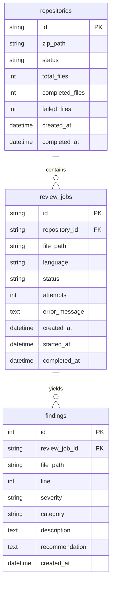

# Architecture Deep Dive

This document details the architectural design and distributed processing patterns implemented in the Distributed AI Code Review System.

---

## 1. System Components

```mermaid
flowchart LR
    API["FastAPI Server<br/>:8000"]
    RepoQueue[("repository_queue")]
    ReviewQueue[("review_queue")]
    DLQ[("review_dlq")]
    RepoWorker["Repository Worker"]
    ReviewWorkers["Review Workers (1..N)"]
    PostgreSQL[("PostgreSQL Database")]
    Storage[("Shared Disk Storage")]

    API -->|1. Enqueue Archive| RepoQueue
    API -->|Save Archive| Storage
    RepoQueue -->|2. Consume| RepoWorker
    RepoWorker -->|Extract & Scan| Storage
    RepoWorker -->|Create Review Jobs| PostgreSQL
    RepoWorker -->|3. Fan-out Files| ReviewQueue
    ReviewQueue -->|4. Fair Prefetch (1)| ReviewWorkers
    ReviewWorkers -->|Read File| Storage
    ReviewWorkers -->|Persist Findings| PostgreSQL
    ReviewWorkers -.->|Poison Pill Rejection| DLQ
    API -->|5. Aggregate Status & Results| PostgreSQL
```

### 1.1 FastAPI Ingestion Layer
* **Role**: Accepts incoming ZIP archive uploads, enforces maximum archive bounds (default: 25 MB), persists archives to `/app/storage/uploads`, and creates an initial `Repository` entry in PostgreSQL.
* **Non-Blocking Operation**: The endpoint returns HTTP 202 Accepted within milliseconds, yielding a unique `job_id` so the client can poll asynchronously.
* **Decoupling**: The API server has no knowledge of how files are scanned or how the LLM evaluates them. It simply registers the request and places a message into `repository_queue`.

### 1.2 Repository Worker
* **Role**: Single-responsibility worker that consumes from `repository_queue`.
* **Security Layer**: Protects against directory traversal (Zip Slip) attacks by checking all member paths before extraction. Rejects archives with more than 500 files.
* **Scanning & Filtering**: Discovers valid source files while skipping hidden directories, binary files, and files exceeding size bounds (500 KB).
* **Fan-Out Dispatch**: Creates a `ReviewJob` row for each valid file in PostgreSQL and publishes a lightweight message to `review_queue` containing only metadata (file path, language, job ID, repository ID).

### 1.3 Scalable Review Workers
* **Role**: Competing consumers that consume from `review_queue`.
* **Fair Dispatch**: Configured with `channel.basic_qos(prefetch_count=1)` so RabbitMQ delivers only one unacknowledged job to any worker at a time.
* **Statelessness**: Workers do not hold session state; they read the designated source file from shared storage, execute the analysis, update the database, and issue a RabbitMQ `basic_ack`.

---

## 2. Queue Topologies & Configurations

| Queue Name | Durability | QoS Prefetch | DLX / Routing Key | Consumers |
|---|---|---|---|---|
| `repository_queue` | `durable=True` | Default | None | `repository-worker` |
| `review_queue` | `durable=True` | `prefetch_count=1` | `x-dead-letter-exchange: dlx_exchange`<br/>`x-dead-letter-routing-key: review_dlq` | Scalable `review-worker` (1..N) |
| `review_dlq` | `durable=True` | Default | Direct binding to `dlx_exchange` | Dead-letter monitor / Admin inspection |

---

## 3. Database Entity Relationship



### Concurrency Protection
In a distributed environment with multiple review workers completing files concurrently, multiple processes write to the `repositories` record simultaneously. To prevent lost updates, `increment_repo_file_counters` executes an atomic SQL update:

```sql
UPDATE repositories
SET completed_files = completed_files + 1
WHERE id = :repository_id;
```
When `(completed_files + failed_files) >= total_files`, the repository status transitions automatically to `completed`.
