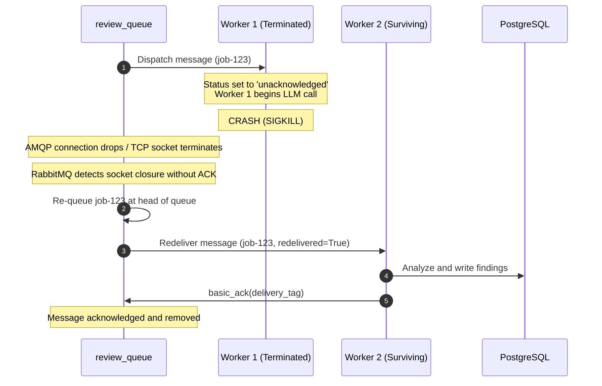

# Fault Tolerance & Reliability Design

This document describes the failure-handling mechanisms, message acknowledgment lifecycle, and recovery guarantees implemented in the system.

---

## 1. Message Acknowledgment & At-Least-Once Delivery

RabbitMQ supports two modes of message delivery: automatic acknowledgment (`auto_ack=True`) and manual acknowledgment (`auto_ack=False`). This project strictly uses **manual acknowledgment**.

### Message Processing Lifecycle:
1. **Consumer Receive**: RabbitMQ marks the message as `unacknowledged` for the receiving consumer.
2. **Execution**: The worker reads the code, runs the analysis, and saves findings to PostgreSQL.
3. **Acknowledgment (`basic_ack`)**: Only after PostgreSQL transactions commit successfully does the worker issue `channel.basic_ack(delivery_tag)`. RabbitMQ then safely removes the message from the queue.

---

## 2. Worker Crash Scenario (SIGKILL mid-flight)

When a review worker process or container crashes unexpectedly (due to OOM, host failure, or an unhandled termination):

### Verified Live Results:
In the automated experiment [`benchmark/fault_tolerance_experiment.py`](file:///c:/Ankith/code-reviewer/benchmark/fault_tolerance_experiment.py):
* A workload of 30 files was dispatched across review workers.
* Worker container `code-reviewer-review-worker-2` was abruptly killed with `docker kill` (SIGKILL).
* The unacknowledged job was redelivered by RabbitMQ to surviving workers.
* Result: **30 out of 30 jobs completed successfully with 0 permanent failures and 0 data loss.**

---

## 3. Poison Pill & Dead-Letter Queue (DLQ) Handling

If a malformed source file or unexpected model failure triggers an exception:

1. **Attempt Counter**: The message payload includes an `attempt` integer (defaulting to 1).
2. **Retry Loop**: If an error occurs and `attempt < 3`:
   * The current delivery tag is acknowledged.
   * A new message is re-published to `review_queue` with `attempt = attempt + 1`.
3. **Dead-Letter Exchange (DLX)**:
   * If `attempt >= 3`, the worker rejects the message via `channel.basic_nack(delivery_tag, requeue=False)`.
   * Because `review_queue` is configured with `x-dead-letter-exchange: dlx_exchange`, RabbitMQ automatically forwards the rejected message to `review_dlq`.
   * This prevents poison messages from blocking the active queue indefinitely.

---

## 4. Concurrency & Deduplication Limitations

* **At-Least-Once Delivery**: RabbitMQ guarantees at-least-once processing, not exactly-once.
* **Potential for Duplicate Work**: If a worker executes the LLM analysis and writes findings to the database, but crashes before sending `basic_ack`, RabbitMQ will redeliver the message. The second worker will re-execute the review.
* **Mitigation**: Finding records are tied to unique `review_job_id` foreign keys and can be idempotently replaced using database transactions.
