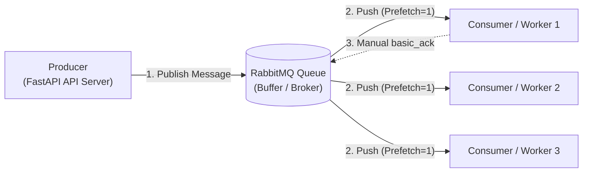
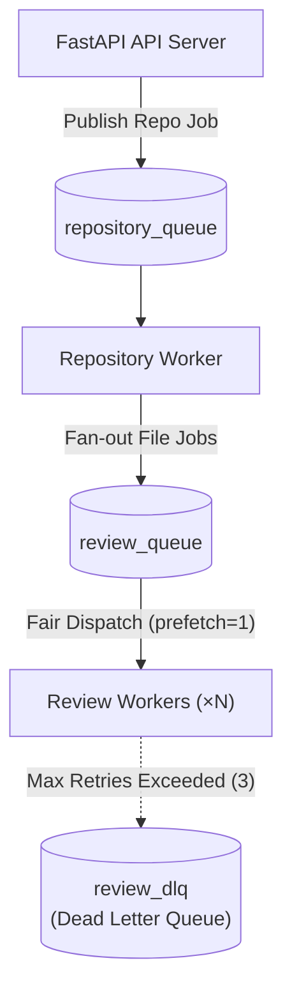

# Message Queues: Core Concepts, Properties & Project Architecture

This document provides comprehensive technical notes explaining **Message Queues (MQ)**, their foundational properties, and how & why they are implemented in the **Distributed AI Code Review System**.

---

## 1. What is a Message Queue?

A **Message Queue** is a form of asynchronous inter-process communication (IPC) that enables decoupled components to exchange data without directly calling or waiting for one another.

### Core Terminology:
* **Producer**: An application component that creates and sends messages (e.g., FastAPI server receiving ZIP uploads).
* **Message**: A discrete unit of data containing headers, metadata, and a payload (e.g., JSON containing `{ "job_id": "...", "file_path": "..." }`).
* **Queue**: An in-memory or persistent buffer hosted by a broker (e.g., RabbitMQ) that stores messages sequentially until consumers retrieve them.
* **Consumer / Worker**: Background processes that subscribe to queues, pull or receive messages, execute processing, and report completion back to the broker.



---

## 2. Core Properties of Message Queues

### A. Decoupling (Spatial & Temporal)
* **Spatial Decoupling**: Producers and consumers do not need to know each other's IP addresses or system locations. They only interact with the broker queue.
* **Temporal Decoupling**: The producer and consumer do not need to be online or active at the same time. If all workers are down, messages wait safely in the queue until workers resume.

### B. Asynchronous Processing
Instead of holding an HTTP request open while an expensive operation finishes (e.g., extracting archives or running LLM analysis), the API returns an immediate `202 Accepted` response with a `job_id`. Processing happens in the background.

### C. Backpressure & Traffic Smoothing (Spike Buffering)
If 1,000 repositories are uploaded simultaneously:
* **Without a Queue**: The server would spawn 1,000 threads/processes, leading to Memory Exhaustion (OOM) or API crash.
* **With a Queue**: RabbitMQ buffers the 1,000 jobs. Workers process them at a controlled pace (e.g., 4 at a time) without overloading system resources.

### D. Competing Consumers & Horizontal Scalability
Multiple review workers subscribe to the same queue. RabbitMQ distributes jobs among active workers. Adding more worker containers increases throughput linearly up to serial bottlenecks without changing application logic.

### E. At-Least-Once Delivery & Fault Tolerance
* **Manual Acknowledgment (`basic_ack`)**: A message is deleted from the queue *only after* a worker completes processing and sends an explicit acknowledgment.
* **Worker Crash Recovery**: If a worker container dies mid-flight (e.g., `SIGKILL` or network drop), RabbitMQ detects the closed TCP socket and redelivers the unacknowledged job to a surviving worker.

### F. Poison Pill & Dead-Letter Queue (DLQ) Handling
A "poison pill" is a broken or malformed message that crashes consumers every time it is processed. Dead-Letter Queues (DLQ) catch these messages after a maximum retry threshold ($N=3$), preventing endless crash loops.

---

## 3. How Message Queues are Used in Our Project

In our Distributed AI Code Review System, we use **RabbitMQ** with a **two-tier queue architecture**:



### 1. `repository_queue` (Stage 1: Ingestion & Extraction)
* **Publisher**: `POST /review` API endpoint in [`api/routes/review.py`](file:///c:/Ankith/code-reviewer/api/routes/review.py).
* **Consumer**: `workers/repository_worker.py`.
* **Payload**: `{ "repository_id": "repo-abc123", "zip_path": "/app/storage/uploads/repo-abc123.zip" }`.
* **Action**: Extracts the archive safely (Zip Slip protection), recursively scans source code files, inserts `ReviewJob` records into PostgreSQL, and fans out file jobs into `review_queue`.

### 2. `review_queue` (Stage 2: File Analysis)
* **Publisher**: `repository_worker.py`.
* **Consumers**: Scalable `workers/review_worker.py` instances (`--scale review-worker=4`).
* **Payload**: `{ "job_id": "job-123", "repository_id": "repo-abc123", "file_path": "src/auth.py", "language": "python", "attempt": 1 }`.
* **Action**: Reads source file from disk, sends code to LLM service, saves findings to PostgreSQL, updates job status, and issues `basic_ack`.

### 3. `review_dlq` (Dead Letter Queue)
* **Trigger**: If a review job throws unhandled errors $3$ times.
* **Mechanism**: Configured via RabbitMQ arguments `x-dead-letter-exchange: dlx_exchange` and `x-dead-letter-routing-key: review_dlq`. When a worker calls `basic_nack(requeue=False)`, RabbitMQ routes the job to `review_dlq` for isolated inspection.

---

## 4. Specific RabbitMQ Features Configured in Code

Our [`services/rabbitmq.py`](file:///c:/Ankith/code-reviewer/services/rabbitmq.py) implementation explicitly sets up critical production AMQP properties:

1. **Queue Durability (`durable=True`)**: Ensures queues survive RabbitMQ container reboots.
2. **Message Persistence (`delivery_mode=2`)**: Messages are written to disk by the broker so queued jobs are not lost if RabbitMQ restarts.
3. **Fair Dispatch (`prefetch_count=1`)**:
   ```python
   channel.basic_qos(prefetch_count=1)
   ```
   Tells RabbitMQ not to give more than 1 message to a worker at a time until it acknowledges its current job. This ensures even workload distribution across all active workers.

---

## 5. Why We Chose RabbitMQ Over Alternatives

| Consideration | Sync HTTP Call | Celery + Redis | Apache Kafka | RabbitMQ (Chosen) |
|---|---|---|---|---|
| **Architecture** | Synchronous | Task Queue Framework | Event Streaming Log | AMQP Message Broker |
| **API Response Time** | Slow (seconds to minutes) | Fast (Async) | Fast (Async) | Fast (Async) |
| **Worker Scaling** | Monolithic / None | Scalable | Scalable via Partitions | Scalable via Competing Consumers |
| **Routing / DLQ** | Manual | Basic | Manual | Built-in Dead-Letter Exchanges |
| **Overhead** | Low | High (Framework bloat) | Very High (Cluster complexity) | Lightweight & Explicit AMQP control |

### Interview Summary: Why RabbitMQ for this system?
> "We chose RabbitMQ because our workload requires lightweight task queue semantics with fine-grained AMQP control. Features like `prefetch_count=1` fair dispatch, manual acknowledgments, persistent messages, and native dead-letter exchanges allow us to build a robust, fault-tolerant distributed worker system without the operational complexity of Kafka partitions or the framework abstraction overhead of Celery."
